🛡️ Phishing Email Detection & Awareness System

 
 


**A Comprehensive Cybersecurity Awareness Report on Banking Phishing**

[Analysis](#detailed-phishing-indicators) • [Attack Flow](#attack-lifecycle) • [Prevention](#prevention-guidelines) • [Author](#author)

---

## 📌 Executive Summary

This project is a detailed forensic analysis of a **High-Risk Phishing Email** impersonating **Bank of Baroda**. The objective is to dissect the social engineering tactics used by attackers and educate users on how to identify red flags before falling victim to credential theft.

**🔍 Scope of Analysis:**
*   **Type of Attack:** Credential Harvesting / Financial Phishing.
*   **Methodology:** Visual Inspection & Passive Analysis (No active exploitation).
*   **Outcome:** Identification of 6 major phishing indicators including email spoofing and domain masquerading.

---

## 🎯 Project Objectives

1.  🔍 **Analyze** a real-world banking phishing email sample.
2.  🚩 **Identify** clear phishing indicators (Red Flags).
3.  ⚖️ **Classify** the risk level based on technical findings.
4.  👥 **Educate** users on safe online practices and prevention measures.

---

## <a id="detailed-phishing-indicators"></a> 🚨 Detailed Phishing Indicators

The following vulnerabilities and red flags were identified during the analysis:

### 1. Email Spoofing (Fake Sender)
The email claims to originate from the bank, but the headers reveal a third-party domain.
```text
Fake Sender: bobsupport@cardsbranch.com
Real Domain: @bankofbaroda.in
```
> **⚠️ Red Flag:** Attackers use unrelated domains to bypass basic spam filters.

### 2. Social Engineering (Urgency & Fear)
The subject line and body utilize psychological pressure to bypass rational thinking.
```text
Subject: "Urgent: Verify Your Account Immediately"
Message: "Failure will result in account suspension"
```

### 3. Domain Masquerading (Typosquatting)
The email displays a URL that looks legitimate but is actually a spoofed domain.
```text
Displayed: bank-of-baroda.bank.in
Reality: Not an official Bank of Baroda asset.
```

### 4. Malicious Call-to-Action (Button)
A prominent button designed to harvest credentials.
```text
[VERIFY YOUR ACCOUNT]
```
> **Note:** Banks never request account verification via embedded buttons in emails.

### 5. Suspicious Embedded URL
The link uses "trust words" to appear safe.
```text
URL: bobsecure-bank-verification.in/login
```
*Even though the link may use HTTPS, it is controlled by the attacker.*

---

## <a id="attack-lifecycle"></a> ⚙️ Attack Lifecycle

This diagram illustrates how the phishing attack executes step-by-step:

```mermaid
graph LR
    A[Attacker] -->|Spoofed Email| B[Victim's Inbox]
    B -->|Fear & Urgency| C{User Action}
    C -->|Clicks Link| D[Fake Login Page]
    C -->|Ignores| Z[Safe ✅]
    D -->|Enters Credentials| E[Data Captured]
    E -->|Harvested| F[Attacker Server]
    F -->|Financial Fraud| G[Loss 💸]
    
    style A fill:#ff9999
    style D fill:#ff9999
    style F fill:#ff9999
    style Z fill:#99ff99
```



---

## <a id="prevention-guidelines"></a> 🛡️ Prevention Guidelines

### ✅ Do's
| Action | Description |
| :--- | :--- |
| **Verify Sender** | Always double-check the email address domain. |
| **Manual Access** | Type the bank's URL manually or use the official app. |
| **Report** | Forward suspicious emails to your IT security team. |

### ❌ Don'ts
| Action | Risk |
| :--- | :--- |
| **Click Links** | Never click "Verify Account" buttons in emails. |
| **Panic** | Ignore threats regarding immediate suspension. |
| **Share Data** | Never share OTP, PIN, or Passwords via email. |

### 💡 Pro-Tip: The HTTPS Myth
> **HTTPS does not guarantee safety.**
> Phishing sites often use HTTPS to get the "Padlock" icon. Always look at the **domain name**, not just the lock.

---

## 🚨 Immediate Action Steps

If you have encountered this email:

1.  **Do Not Click:** Avoid clicking any links or buttons.
2.  **Verify Independently:** Log in to your bank account via their official mobile app only.
3.  **If Clicked:**
    *   Change your password immediately.
    *   Enable 2-Factor Authentication (2FA).
    *   Contact the bank via the number on the back of your debit/credit card.
4.  **Report:** Mark the email as **Phishing** in your email client.

---

## 📂 Repository Structure

```
.
├── Phishing Email Detection.pdf   # Full Project Report
└── README.md                      # Project Documentation
```

---

## <a id="author"></a> 👨‍💻 Author & Credits

**Submitted By:** Sachin Kumar

**⚠️ Disclaimer**
*This project is strictly for **educational and awareness purposes**. No unauthorized access or hacking was performed. The goal is to promote cybersecurity hygiene.*

**Made with ❤️ for Cybersecurity Awareness**
``
